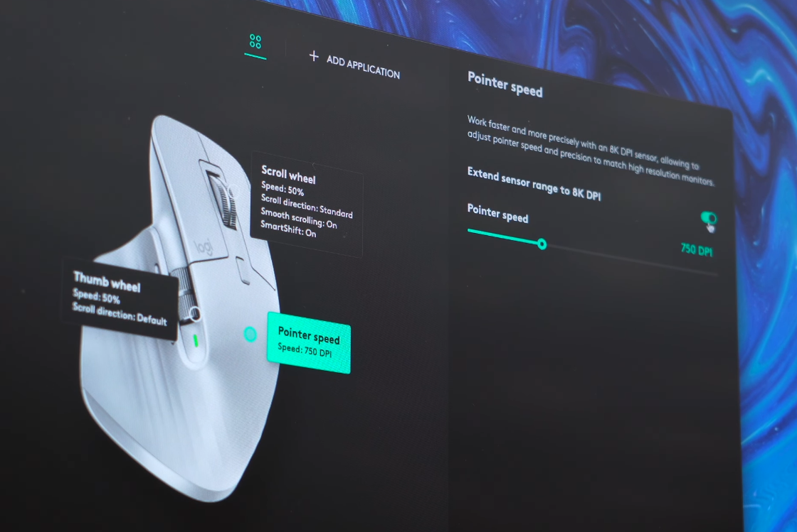

In the Logitech Logi Options+ software for the Mx Master 3, there is no way to tell the dpi of the mouse as the pointer speed option is in percentage.

Note: For the newer MX Master 3S, you can set the pointer speed with the exact dpi by toggling "Extend sensor range to 8k DPI in Logi Options+

> Credit: [Cole Caccamise on Youtube: Logitech Made The MX Master 3S PERFECT](https://www.youtube.com/watch?v=hIYyjRAsCoA)

<hr />

Upon further research by r/Nathraichean on [Reddit](https://www.reddit.com/r/LogitechG/comments/joshln/mx_master_3_how_to_change_dpi/). 
>After a bit of further testing, every percentage of Pointer Speed is about 2.8121% faster/slower than its previous percentage.
So if you take 1000 and then start multiplying it by 1.1486984 or 0.8513016, you get the 5% increments in the Logi Options+ software. Please note that there is most probably a fairly easy function that can be calculated for this but I am not smart enough to figure that out.
Below are the DPI values in 5% increments. If you'd like a more precise DPI setting, get the closest setting from below, if yours is higher than the closest, add 2.8121% to the DPI number and if it is still higher, add another 2.8121% to the new DPI number that you got and so on. If its lower than the closest setting from below, just subtract 2.8121% instead of add. Please note that DPI differences of less than 50 are very hard/impossible to notice.
0% - 200 DPI
5% - 235 DPI
10% - 276 DPI
15% - 324 DPI
20% - 381 DPI
25% - 447 DPI
30% - 525 DPI
35% - 617 DPI
40% - 725 DPI
45% - 851 DPI
50% - 1000 DPI
55% - 1149 DPI
60% - 1320 DPI
65% - 1516 DPI
70% - 1741 DPI
75% - 2000 DPI
80% - 2297 DPI
85% - 2639 DPI
90% - 3031 DPI
95% - 3482 DPI
100% - 4000 DPI

<hr />

Another user r/210000Nmm-2 also commented:

I had a similar problem since I wanted to know the currently set DPI value which is not available in Logitech Options, unfortunately.

Luckily, I noticed the option to backup the settings into the cloud which implies that the slider value among the other options are saved somewhere on the disk.

In *%appdata%/Logishrd/LogiOptions* I found a few settings files that are human-readable (XML):

At first, you need to get the UUID of the profile you are using. In the directory aforementioned, open *apptable.xml* in an editor with XML-support (I recommend VS Code) or in notepad.exe.

Find the profile for the application you want to look up. In my case it looks like this for CS:GO:

```
<profile>
  <name>csgo.exe</name>
  <id>2313a307-6976-4ab8-87d4-b0d07bed022f</id>
  <exe>csgo.exe</exe>
  <altfullpath />
  <fullpath>C:\Program Files (x86)\Steam\steamapps\common\Counter-Strike Global Offensive\csgo.exe</fullpath>
  <iconpath>C:\Program Files (x86)\Steam\steamapps\common\Counter-Strike Global Offensive\csgo.exe</iconpath>
  <iconindex>0</iconindex>
</profile>
```

Note the ID somewhere.

Now, go into *devices/*. There you should find at least one folder. If you're using more Logitech products than the MX Master 3, there might be some more folders, one for each device. I guess, the MX 3 folder is named *6b023* (which is the name on my computer). Go into it.

Open *Profiles/*.

Load the file which has the name of the profile's UUID you wrote down in an editor. In my case, this is *2313a307-6976-4ab8-87d4-b0d07bed022f.xml*.

Press Crtl+F and search for `dpi`.

You should find something like this:

```
<params>
  <param name="sensorCount" value="1" />
  <param cur="1150" defaultDPI="1000" minDPI="200" maxDPI="4000" stepDPI="50" name="sensor" value="0" />
</params>
```

The value `cur="1150"` should be your sensitivity in DPI.