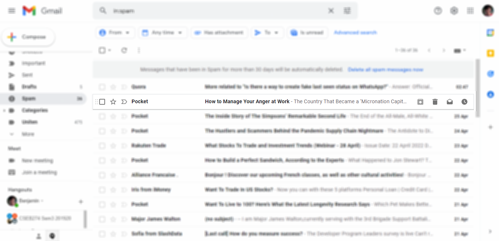

# UX: Disable or hide button?

> "Cognitive load and visual appeal are important to think about too but not at the expense of confusing or frustrating your users."

### Some arguments for using a disabled state:

- Even if not in use, the user has a chance to learn that the action is possible. You may even have a tooltip explaining the criteria for use.
- The user can learn where controls and buttons live within the interface.

### Some arguments for hiding the button:

- Clarity. Only showing what is needed for the task at hand. Attention is focused.
- It allows you to change the controls, using the same space for different means.

### The questions you should ask yourself are

- "What does the user need to know at this point?"
- "What does the user need to do at this point?"

> ### While simplicity is a great goal, you should never simplify more than necessary. Therefore if the user needs to know about the existence of the button, or you need to build the context, you might need to consider it.

### Common answers you would get on the internet are:

1. When an element is not permitted to be used by a given user due to a lack of permissions to use it, it should be hidden from the interface.
2. When an element is permitted for a user:
   1. If an element may become available for use based on other things changing on the same screen (such as a Button being useful only when the value of a Select dropdown is changed, or an input field filled), show the element at all times, but disable it until it is possible to use it. Additionally, show a tooltip on the disabled element explaining what might cause it to become enabled.
   2. If an element can never become interactive by changing something on the same screen, but it is necessary to show it to users because of the information it contains (such as auto-generated ID fields on Edit record screens), show the element in a non-interactive format (i.e. show a text expressing the value in question instead of an input field).
   3. If an element can never become interactive by changing something on the same screen, and it is not necessary to show it to the users (such as a button that is non-functional until a certain type of sub-record is added), hide the element altogether.

### Examples

#### Gmail:

Archive button is disabled for spam emails, but is allowed elsewhere.

### Reference:

1. https://medium.com/swlh/what-happens-when-you-hide-important-ui-functionality-c6b16ffd3b74
2. https://ux.stackexchange.com/questions/24386/inactive-state-of-buttons-to-hide-or-not-to-hide-that-is-the-question
3. https://ux.stackexchange.com/questions/107513/what-is-better-for-ux-hiding-or-disabling-irrelevant-buttons#:~:text=If%20you%20hide%20the%20button,to%20do%20a%20user%20test.
4. https://ux.folio.org/docs/guidelines/ux-patterns/hiding-vs-disabling-elements-ux-pattern/
5. https://www.quora.com/When-is-it-preferable-to-hide-a-disabled-button-in-an-interface-instead-of-showing-it-in-a-disabled-state
